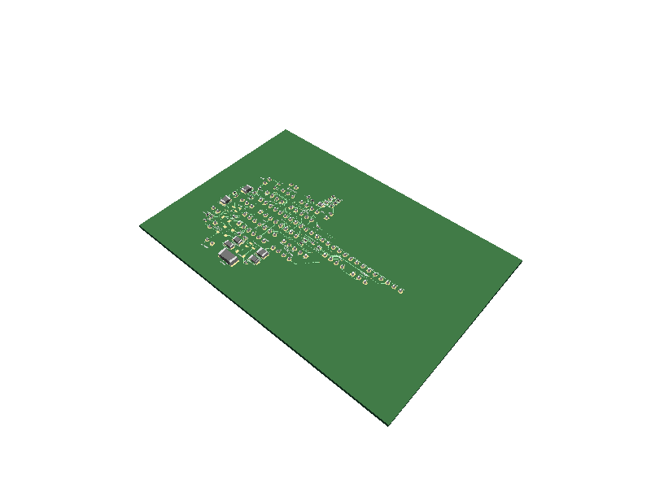
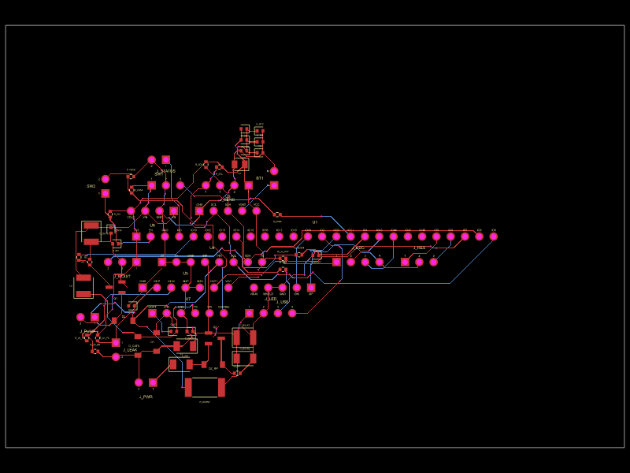
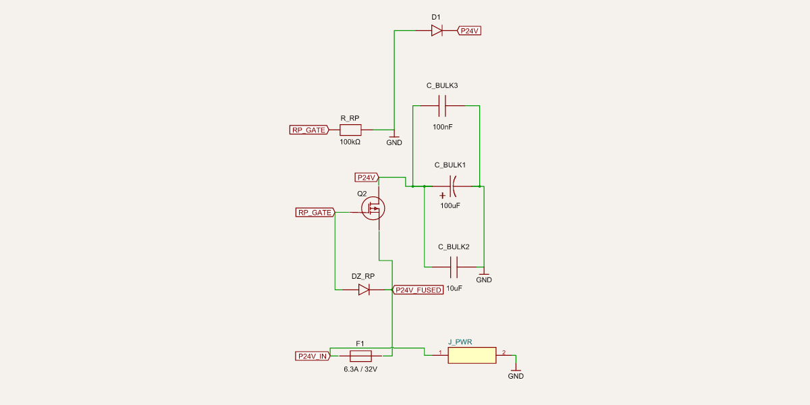
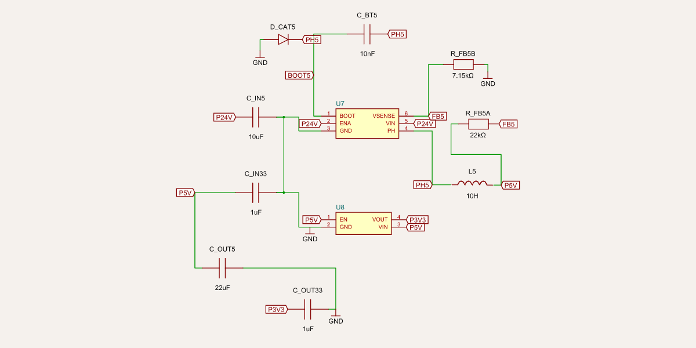
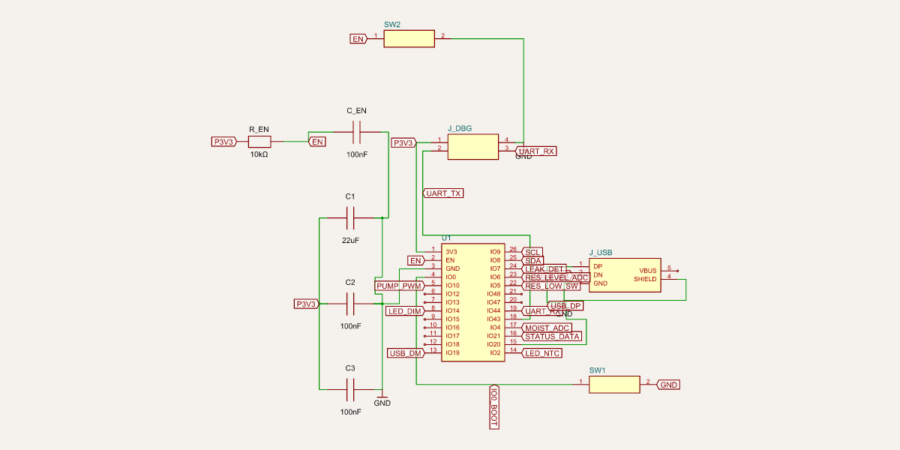
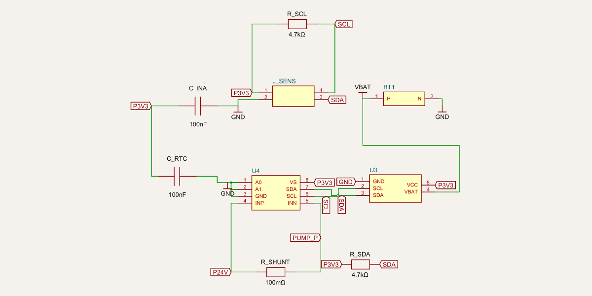
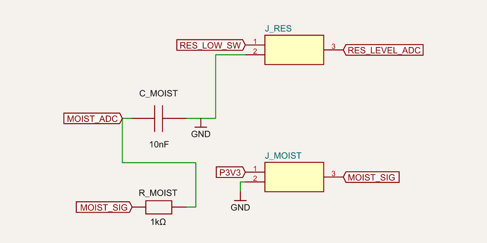
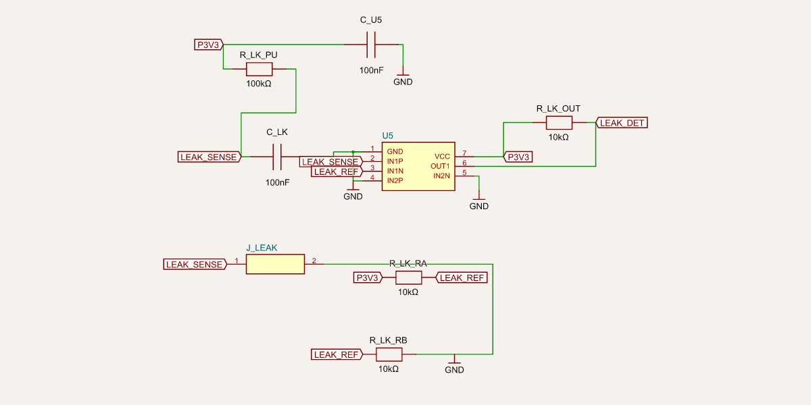
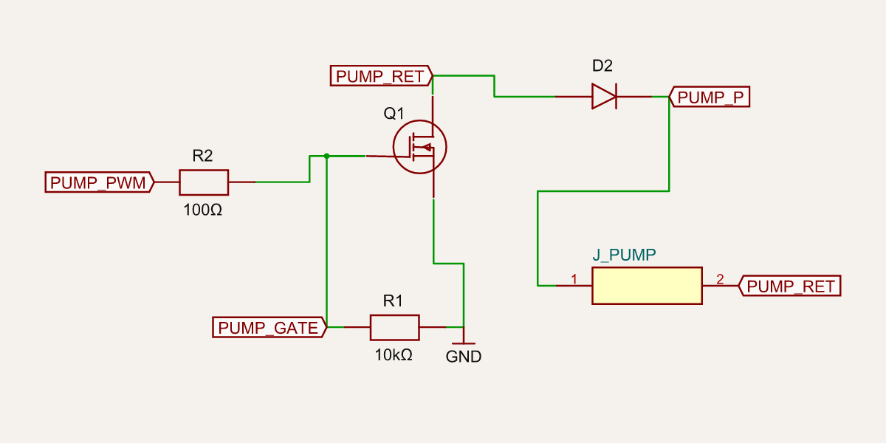
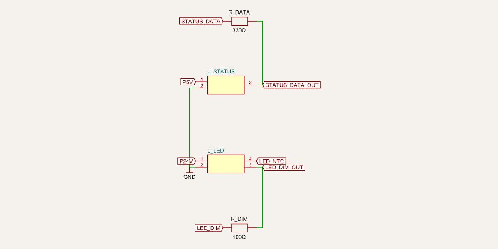

# Electronics design — controller board

The **OpenCanopy controller** is a single custom PCB in the upper **dry bay** that runs the whole
grow cycle: it reads the climate/soil/water sensors, drives the pump and the grow-LED dimming, lights
the 5 front-panel status indicators, and enforces the safety state machine (leak lockout, pump
fail-off, over-temp derate).

It is designed **entirely from code, no GUI**. The schematic is a machine-readable netlist
([`electronics/pcb/netlist/controller_netlist.py`](https://github.com/simon446/opencanopy/blob/main/electronics/pcb/netlist/controller_netlist.py))
that is the single source of truth — every part and every pin-level net — and is checked in CI (ERC,
BOM coverage, and the firmware pin contract). From that netlist the headless
[tscircuit flow](https://github.com/simon446/opencanopy/blob/main/electronics/pcb/programmatic/)
generates the board, auto-routes it, and exports Gerbers/PnP/BOM. KiCad is **retired**
([ECO-002](https://github.com/simon446/opencanopy/blob/main/electronics/analysis/ECO-002-pcb-toolchain.md)).

> **Design decisions baked in:** no fan (V1 is passively cooled — [ECO-001](https://github.com/simon446/opencanopy/blob/main/electronics/analysis/ECO-001-fan-removal.md));
> a single external certified 24 VDC brick (no mains inside the unit); the pump **fails OFF** in
> hardware; the leak detector **latches** a pump lockout.

The renders below are generated by
[`render.sh`](https://github.com/simon446/opencanopy/blob/main/electronics/pcb/programmatic/render.sh):
per-subsystem **schematics** straight from the netlist, plus the full auto-routed board.

---

## The board

A 4-layer board (signal / GND / power / signal), ~110 × 75 mm, in the dry bay. 60 populated parts;
the fan-drive, the optional 12 V buck, the 0–10 V LED-dim op-amp, and the expansion headers are
**DNP** (footprints only).





> **These two are an auto-placement / autorouter *draft*.** They prove the headless netlist → board →
> Gerbers pipeline end-to-end, but they are **not** fab-ready: the IC/connector/module footprints are
> single-row `pinrowN` placeholders (right pin *count*, wrong land pattern), and the autorouter packs
> parts tightly and ignores the power/analog separation and copper pours called for in
> [`design-rules.md`](https://github.com/simon446/opencanopy/blob/main/electronics/analysis/design-rules.md).
> The **schematics** below are the considered design; the board is the machine translation that still
> needs real footprints + a reviewed layout. See [Status & residual](#status--residual).

---

## Subsystems

Each block is rendered straight from the netlist, so the schematic *is* the source of truth. Labelled
boxes (e.g. `+3V3`, `GND`, `PUMP_PWM`) are net stubs — connections that leave the block.

### 1. Power input & protection



The 24 V brick enters at `J_PWR` (XT30, locking). In order: **`F1`** input fuse (6.3 A; 8 A for the
150 W build) → **`Q2`** P-channel MOSFET for **reverse-polarity protection** (high-side, low drop; gate
biased by `R_RP`, clamped by the `DZ_RP` Zener so V_GS stays in spec) → the protected **`+24V`** rail.
**`D1`** is an `SMBJ28A` **TVS** clamping input transients below the regulators' and MOSFETs' ratings,
and **`C_BULK1/2/3`** (100 µF electrolytic + 10 µF + 100 nF) absorb pump inrush. This implements the
§17.1 protection chain (fuse + reverse-polarity + TVS) and risk **S1** (no mains inside).

### 2. Power rails (DC/DC)



**`U7`** (TPS5430) bucks **24 V → 5 V** with its inductor `L5`, catch diode `D_CAT5`, input/output
caps, boot cap `C_BT5`, and the `R_FB5A/R_FB5B` feedback divider. **`U8`** (AP2112K) then drops
**5 V → 3.3 V** for the MCU and logic. The **12 V buck (`U6`) is DNP** — it existed only for the fan
and an optional 12 V pump; with no fan (ECO-001) the default 24 V pump build omits it entirely. All
rails carry ≥20 % headroom (see the [power budget](https://github.com/simon446/opencanopy/blob/main/electronics/analysis/power-budget.md);
removing the fan lifted it to 33 %).

### 3. MCU & service ports



**`U1`** is the **ESP32-S3-WROOM-1 (N8R8)**. The render shows its full GPIO map as net stubs — every
signal that crosses to another block (`SDA`/`SCL`, `LEAK_DET`, `RES_LOW_SW`, `MOIST_ADC`, `PUMP_PWM`,
`LED_DIM`, `STATUS_DATA`, `USB_DM`/`USB_DP`, `UART_TX`/`UART_RX`, …). Supporting parts: the `R_EN`/`C_EN`
reset RC, decoupling `C1/C2/C3`, **`SW1` (boot)** / **`SW2` (reset)** (hidden in normal use), the native
**USB-CDC** port `J_USB` (flash + log), and the debug-UART header `J_DBG`. All analog sensors are on
**ADC1** so they keep working while Wi-Fi is active. The pin map here is the contract the firmware HAL
consumes — CI fails if the netlist and
[`pin-map.csv`](https://github.com/simon446/opencanopy/blob/main/electronics/analysis/pin-map.csv) ever disagree.

### 4. I²C bus, RTC & pump-current monitor



The shared **I²C bus** (`R_SDA`/`R_SCL` pull-ups to 3V3) carries three devices: the **`U3` DS3231
battery-backed RTC** (with the `BT1` CR2032 cell — keeps the photoperiod clock across power loss,
DR-05), the **`U4` INA219 pump-current monitor** sensing across the **`R_SHUNT` 0.1 Ω** shunt on the
pump rail (clog / dry-run detection, DR-04, "required V1"), and `J_SENS` out to the cabled SHT40
temp/RH sensor. The RTC is placed away from heat sources to keep its oscillator stable (DR-09).

### 5. Moisture & reservoir



The capacitive soil probe enters at `J_MOIST` through an **`R_MOIST`/`C_MOIST` RC filter** to the ADC,
kept physically away from the pump/LED switching nodes for clean analog. `J_RES` brings in the
reservoir **float switch** (`RES_LOW_SW`, internal pull-up, closed = low) plus an optional analog level
input. Both runs are wet-zone cables that get drip loops (see the connector spec).

### 6. Leak detection (latched lockout)



A conductive leak trace on the drip tray enters at `J_LEAK`. **`U5` (LM393) comparator** turns it into
a clean, debounced digital edge: the trace is pulled up by `R_LK_PU`, compared against the
`R_LK_RA`/`R_LK_RB` reference divider, with `R_LK_OUT` as the open-collector pull-up and `C_LK` for
debounce (the second comparator's inputs are tied off). The edge drives `LEAK_DET`, which the firmware
**latches** into an immediate pump lockout that only a manual clear releases (§11.4, risk **S5**).

### 7. Pump drive — fails OFF (safety-critical)



This is the most safety-critical block. **`Q1`** is a low-side logic-level N-FET switching the pump;
**`R2`** is the 100 Ω gate series resistor and **`R1` is the 10 kΩ gate-to-GND pull-down** — the
**hardware fail-off guarantee**: on MCU reset, crash, or a Hi-Z GPIO, the gate is pulled to 0 V and the
**pump turns OFF without any firmware** (§9.6, §11.4, risk **S6**). `D2` is the flyback for the
inductive pump motor; `J_PUMP` is the locking 24 V connector. The pump current returns through the
INA219 shunt (block 4) so over-current is observable.

### 8. LED dimming & status



`LED_DIM` (PWM, GPIO14) drives the grow-light driver's dim input through `R_DIM` (the optional 0–10 V
op-amp path is DNP — PWM-direct is the default). `STATUS_DATA` (GPIO21) drives the front-panel
WS2812 status board through the `R_DATA` series resistor and `J_STATUS`. The grow light itself connects
at `J_LED` (24 V / GND / DIM / optional heatsink-NTC). The 5-LED status board is a separate PCB
([WI-EE-09](https://github.com/simon446/opencanopy/blob/main/electronics/analysis/WI-EE-09-status-led-board.md)).

---

## Safety design

| Hazard (risk) | Mechanism | Where |
|---|---|---|
| Pump runs after MCU reset/brownout (**S6**) | Gate **pull-down → fails OFF in hardware**, no firmware | block 7 (`R1`) |
| Leak not locked out (**S5**) | Comparator edge → firmware **latched** pump lockout | block 6 + firmware |
| Mains inside the unit (**S1**) | External certified 24 VDC brick only | block 1 / [power budget](https://github.com/simon446/opencanopy/blob/main/electronics/analysis/power-budget.md) |
| Input transients / reverse polarity (§17.1) | Fuse + reverse-polarity P-FET + TVS | block 1 |
| Pump clog / dry-run (DR-04) | INA219 current monitor on a shunt | block 4 |
| LED over-temp (§9.5) | Driver thermal foldback (primary) + firmware air-temp derate | [thermal model](https://github.com/simon446/opencanopy/blob/main/electronics/analysis/WI-EE-10-thermal-budget-model.md) |

No fan means the LED is **passively cooled**; the thermal model confirms the committed 60 W light sits
at T_j ≈ 70 °C on a ≤0.8 °C/W passive heatsink (ECO-001).

---

## Connectors (handoff to mechanical)

All field wiring uses **locking/keyed** connectors — no loose Dupont. Wet-zone cables get drip loops.
The full table (chosen part + mating cable-side part + pinout + the strain-relief/routing requirements)
is the mechanical-team handoff in
[`connector-spec.md`](https://github.com/simon446/opencanopy/blob/main/electronics/wiring/connector-spec.md).

| Connector | Function | Family | Zone |
|---|---|---|---|
| `J_PWR` | 24 V input | XT30 | dry |
| `J_LED` | grow light | JST VH-4 | dry → light |
| `J_PUMP` | pump | JST VH-2 | dry → wet |
| `J_MOIST` / `J_RES` / `J_LEAK` | soil / reservoir / leak | JST PH | dry → wet |
| `J_SENS` | temp/RH + I²C | JST PH-4 | dry |
| `J_STATUS` | front-panel LEDs | JST XH-3 | dry |
| `J_USB` / `J_DBG` | flash / service | USB-C / header | dry |

---

## How it's designed & verified

```
controller_netlist.py   ──ERC + BOM + pin-contract (CI gate)──►  green
   (source of truth)     ──gen_tscircuit.py──►  board.tsx  ──tscircuit──►  Gerbers / PnP / BOM
                         ──emit──►  controller.net / .csv  (optional KiCad interchange)
```

- **Netlist ERC** (`controller_netlist.py --selftest`, runs in CI): no floating nets, no double-driven
  pins, the fail-OFF pump gate present, fan parts DNP, **full BOM coverage**, and every MCU net matches
  the firmware pin map. 90 parts / 61 nets.
- **BOM** ([`bom.csv`](https://github.com/simon446/opencanopy/blob/main/electronics/bom/bom.csv)):
  every populated part incl. all passives, passing `bom_check.py --strict` (which also enforces the
  §16.3 grow-light data gate).
- **Layout contract**: [`design-rules.md`](https://github.com/simon446/opencanopy/blob/main/electronics/analysis/design-rules.md)
  (net classes, widths, clearances, stackup, placement).
- **Trace/thermal**: [`pcb-verification.md`](https://github.com/simon446/opencanopy/blob/main/electronics/test/pcb-verification.md)
  + [thermal model](https://github.com/simon446/opencanopy/blob/main/electronics/analysis/WI-EE-10-thermal-budget-model.md).

### Reproduce

```sh
electronics/pcb/programmatic/build.sh     # netlist → board → Gerbers (out/)
electronics/pcb/programmatic/render.sh    # regenerate these renders into docs/assets/renders/
```

---

## Status & residual

**Done & CI-verified:** the complete electrical design (netlist), the BOM, the connector spec, the
power/thermal budgets, the design rules, and a working headless netlist → Gerbers pipeline.

**Residual (the same regardless of EDA tool):**

1. **Real footprints** for the ICs, connectors, and the ESP32-S3 module (the draft uses `pinrowN`
   placeholders).
2. A **reviewed power/analog/thermal placement + route** per the design rules (the autorouted draft
   doesn't encode them).
3. **Physical** steps that need hardware: breadboard PoC bench logs (WI-EE-01) and board bring-up +
   HIL (WI-EE-08) — the HIL fault-test *logic* is already dry-validated against the firmware host-tests.

These are tracked in the [electronics work items](https://github.com/simon446/opencanopy/tree/main/plan/work-items/03-electronics).
