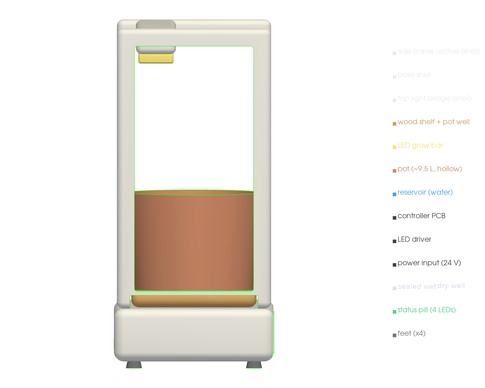
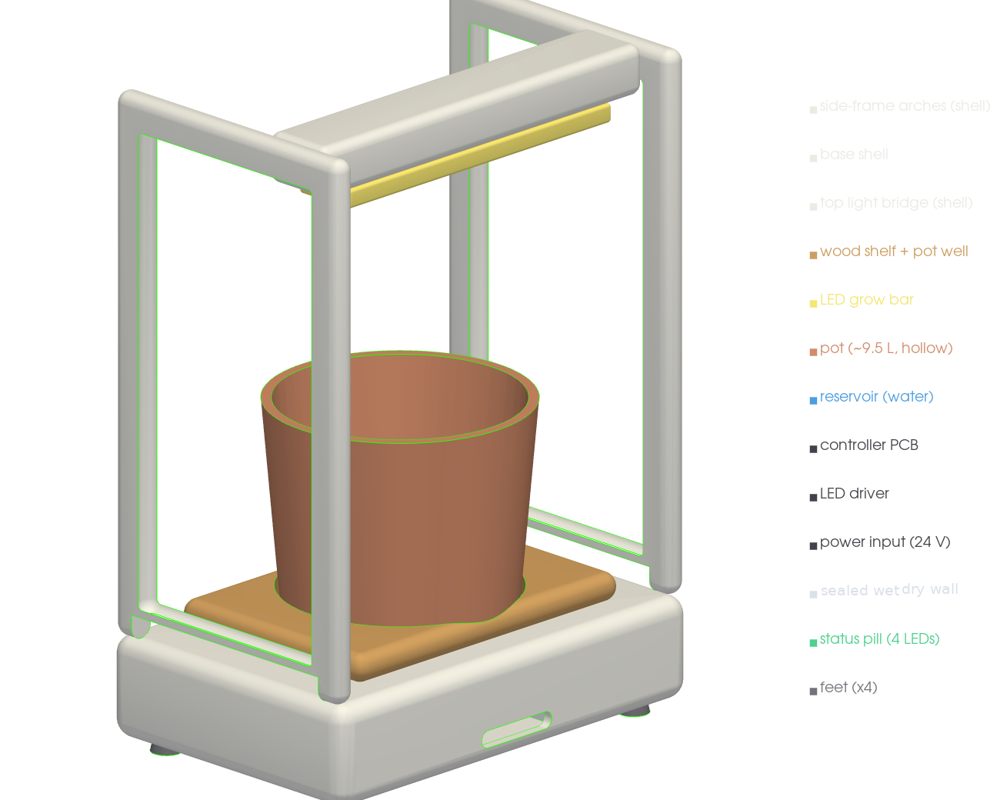
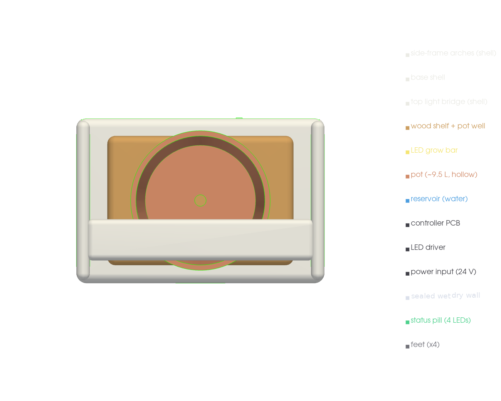
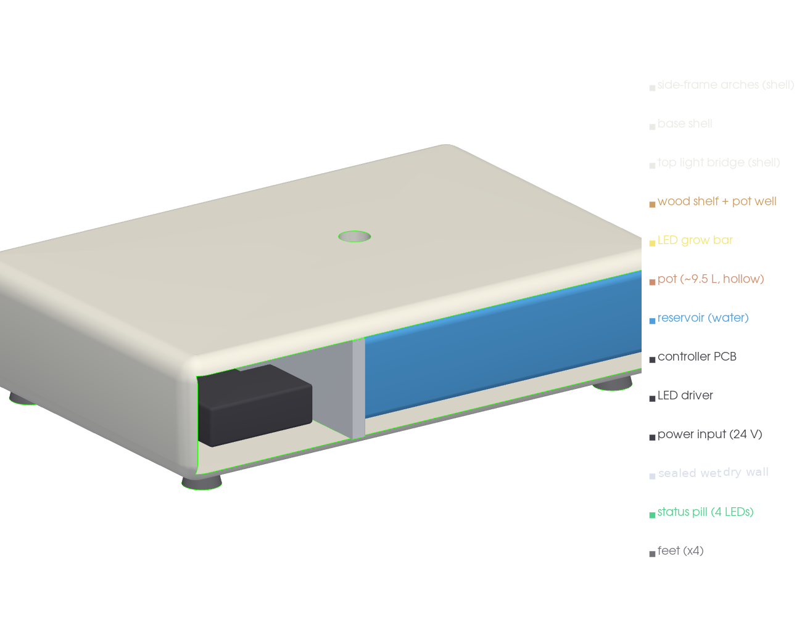

# Mechanical build — v1 aesthetic product model

Renders of the **OpenCanopy v1 aesthetic model** within the **480 × 320 × 680 mm**
envelope, from the parametric OpenSCAD source
(`mechanical/cad/opencanopy_tabletop_pepper_v1_block_model.scad`). Rendered with a real
z-buffered renderer (VTK) and collision-checked with FCL — see
`mechanical/cad/render_block.py`.

**Form:** a compact Scandinavian tabletop appliance — two continuous **rounded
side-frame arches**, a slim **top light bridge**, a slimmer **footed base** with rounded
corners and a recessed rear service bay, a raised **wood shelf** with a recessed pot
well, and a small **pill status diffuser** (4 LED dots). Open front and sides; no
screen, no controls.

**Architecture (unchanged from v0):** **electronics + reservoir live in the base, side
by side, separated by a sealed vertical wall** (wet | wall | dry). Fixed LED grow bar
under the bridge. Fastening (heat-set inserts + screws at the arch↔base / arch↔bridge
joints) — see [fastening & assembly](fastening.md).

## Product views








## Rear / service cutaway

Shell + canopy hidden to expose the base: **electronics (dark service) | sealed wall |
reservoir (water)**, side by side, with the rear service bay and the deck drain. This is
the only view where the reservoir is exposed.



## Validation

- **Collision (FCL):** all part-vs-part pairs checked; **no unintended collisions** —
  reservoir and electronics clear the cabinet deck/walls and are separated by the sealed
  wall. Run: `.venv-cad/bin/python mechanical/cad/render_block.py`.
- **Material grouping:** white structural shell (arches, base, bridge) · wood shelf ·
  dark recessed service (electronics) · reservoir (shown only in cutaway).

Reproduce:

```sh
openscad -o out.stl mechanical/cad/opencanopy_tabletop_pepper_v1_block_model.scad
# one part: -D 'part="pot"'  (side_frames/base/bridge/shelf/pot/reservoir/pcb/iso_wall/…)
.venv-cad/bin/python mechanical/cad/render_block.py   # all renders + collision check
```
