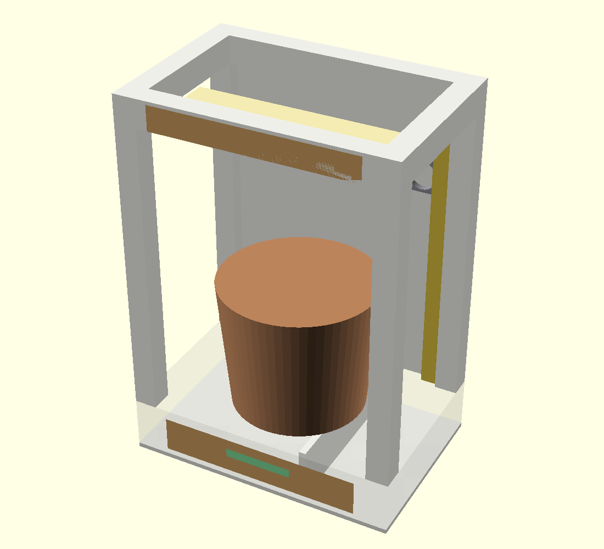
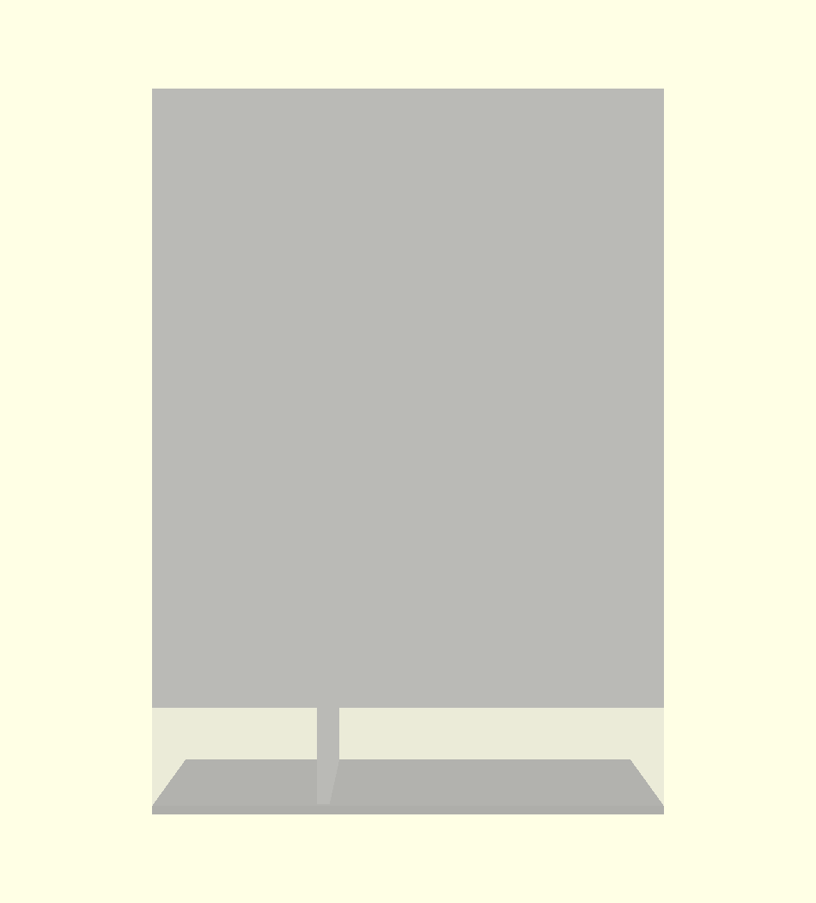
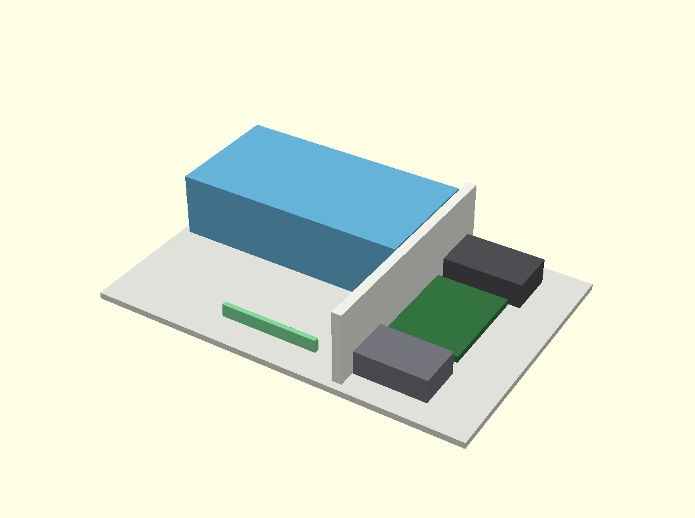

# Mechanical build — v0 block model

Renders of the **OpenCanopy V1 v0 block model** within the locked **480 × 320 × 680 mm**
envelope. Generated from the parametric OpenSCAD source
(`mechanical/cad/opencanopy_tabletop_pepper_v1_block_model.scad`) per the
[CAD brief](cad_brief_for_claude.md); simple solids only (v0 — visual refinement later).

**Architecture (current):** an open-frame tabletop unit — base cabinet + corner posts +
top hood, open at the front and sides. **The electronics live in the base, *beside* the
water reservoir, isolated by an additional vertical wall** (side-by-side: wet | wall |
dry). A fixed full-spectrum LED bar lights the pot from the hood; a 4-LED status strip
on the front is the only interface (no screen, no controls).

## Exterior





## Base internals — electronics beside the water, behind the isolating wall

The base holds two compartments separated by a solid wall, so a leak or overflow cannot
reach the dry side: **blue reservoir (wet zone) | white isolating wall | dry electronics
(controller PCB, LED driver, power)**. Only low-voltage wires cross the wall; mains stays
out (external 24 V PSU).



## Modules (per the brief)

`outer_frame` · `top_light_module` · `bottom_base` (+ isolating wall) ·
`pot_placeholder` · `reservoir_placeholder` · `electronics_bay` (base, beside water) ·
`fan_mount` · `status_led_diffuser` · `cable_channel` · `assembly`.

Reproduce / re-render:

```sh
openscad -o out.stl mechanical/cad/opencanopy_tabletop_pepper_v1_block_model.scad
# base-internals view: add  -D show_top=false
```

> v0 acceptance (brief): opens without errors; envelope 480 × 320 × 680; front open;
> all modules present; **electronics in the base, beside/isolated from the water**;
> no screen or controls. All met.
