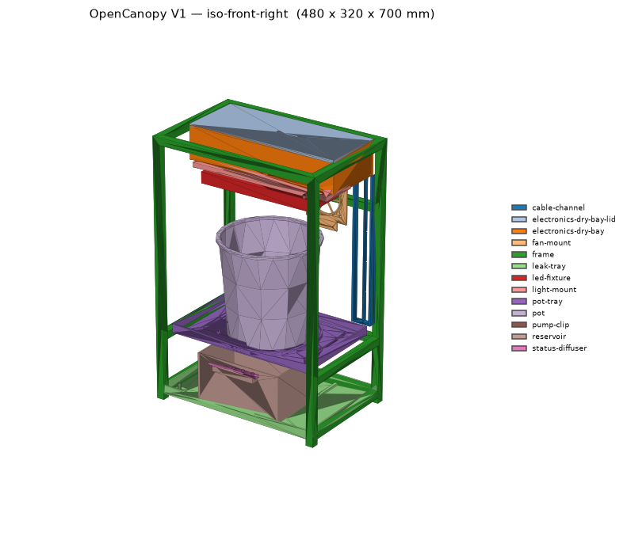
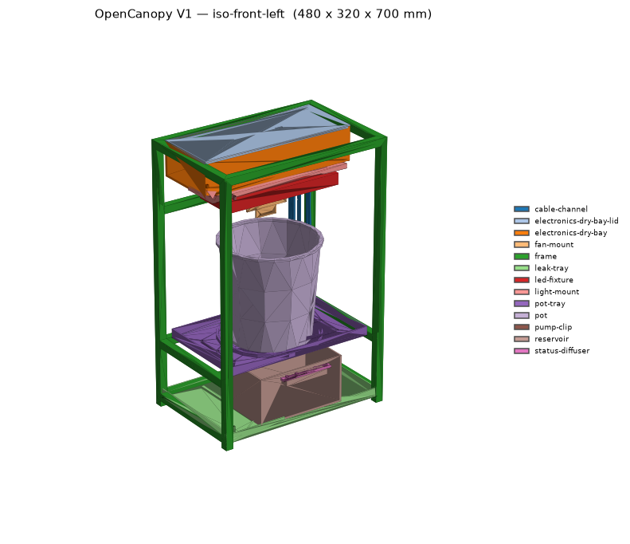
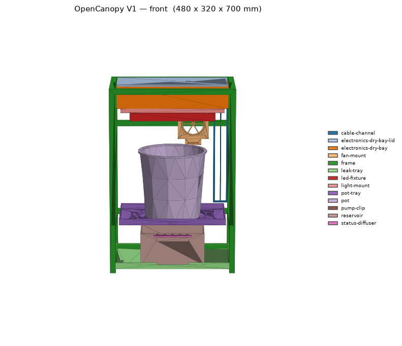
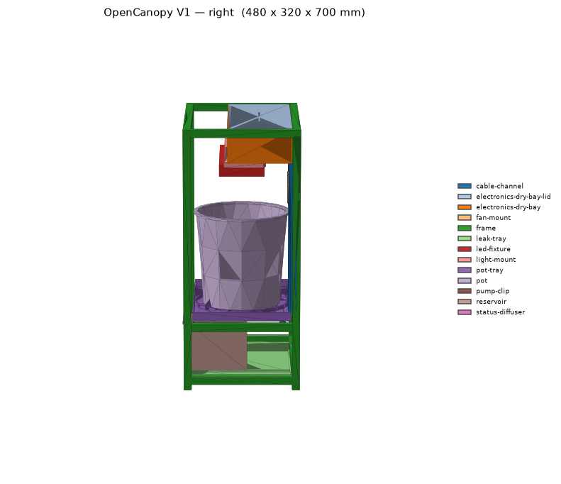
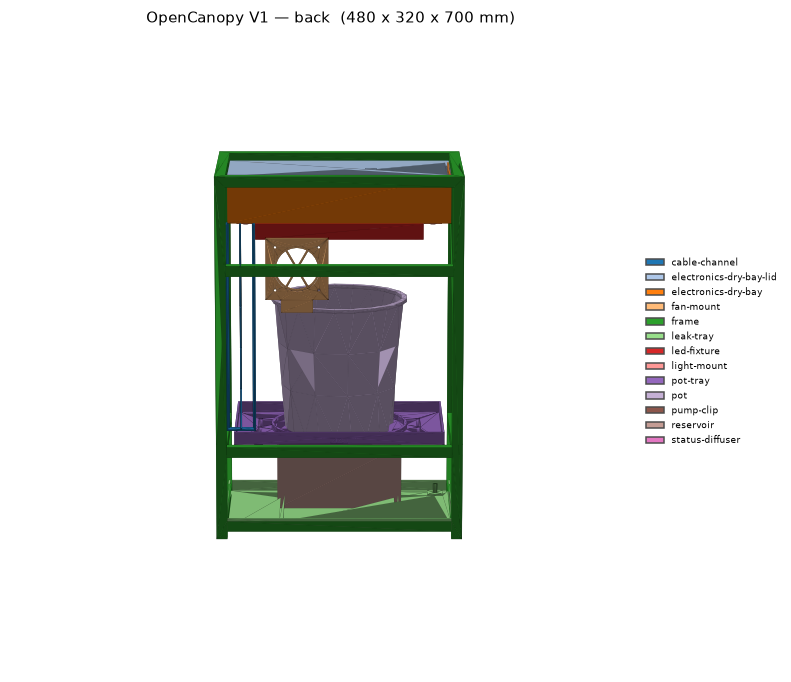
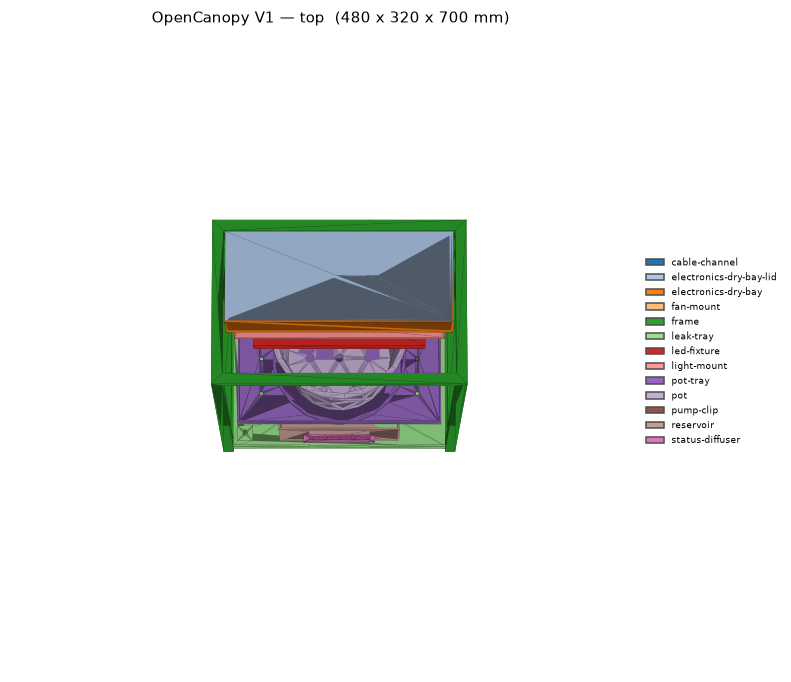

# Mechanical build — full assembly views

Sketch renders of the **complete OpenCanopy V1 assembly** (every part in its placed
position) within the locked **480 × 320 × 700 mm** envelope. They are generated from
the parametric model and refreshed by the Pages CI on every build, so they always
match the current geometry. Each part has a distinct colour (see the legend in each
image) so reviewers can point at and comment on specific modules.

> Source of truth: `mechanical/cad/source/` (parametric build123d model). These images
> are produced by `mechanical/cad/source/render.py` from the placed meshes in
> `mechanical/stl/assembly/`. STEP/STL exports live in `mechanical/cad/step/` and
> `mechanical/stl/`.

## Isometric

## Orthographic

## What to look for

- **Vertical stack & zone separation (§6.2):** electronics dry bay + lid on top;
  grow zone (LED fixture, light mount, fan, cable channel) in the middle; pot on its
  tray; reservoir + pump + leak tray at the bottom. Water lives low, electronics high.
- **Open front (§8.1):** the lower and mid rails are omitted at the front so the
  reservoir drawer pulls out and the pot lifts out without obstruction.
- **Fan (rear):** guarded 92 mm fan on a rear cross-rail, above the pot rim so it
  circulates the canopy rather than blasting a seedling.
- **Light mount:** adjustable carrier just below the dry bay, LED head with secondary
  retention.

## Verification

These views accompany the numeric checks:

- [CAD verification checklist](../mechanical/cad-verification-checklist.md) (§12.1).
- [Tolerance & interference analysis](../mechanical/tolerance-analysis.md) — worst-case
  FCL collision sim on the real models (zero interferences, ≥2 mm clearances).

*(The above two links point into the repo's `mechanical/` tree, not the docs site.)*
