# Mechanical build — v1 product model

Renders of the **OpenCanopy v1 product model** (480 × 320 × 680 mm) from the parametric
OpenSCAD source (`mechanical/cad/opencanopy_tabletop_pepper_v1_block_model.scad`),
rendered with VTK (`mechanical/cad/render_block.py`) and validated by an honest,
no-whitelist geometry audit (`mechanical/cad/audit.py`).

**Architecture (unchanged):** electronics + reservoir in the base, side by side,
separated by a **sealed vertical wall** (wet | wall | dry); open-frame; no fan; no
screen/controls; 4 status LEDs only.

**This revision:** flatter, appliance-like form via **selective edge radii** (crisp,
not uniformly rounded); the **LED optical centerline is centered on the pot at
X = 240, Y = 160**; defined **tab-and-socket + dowel joints** with M4/M3 screws and
straight screwdriver access; a real internal **cable conduit** (base dry bay → right-rear
arch → top bridge → LED).

## Product views

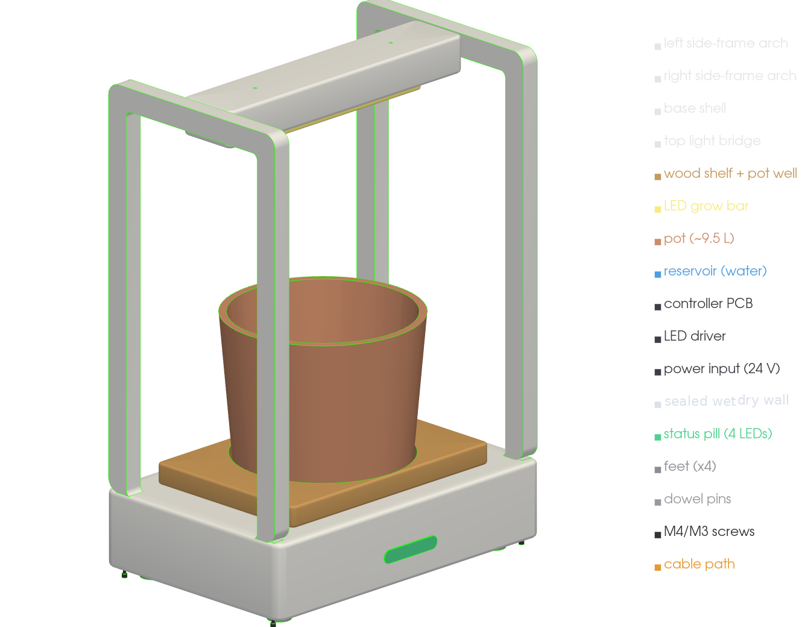

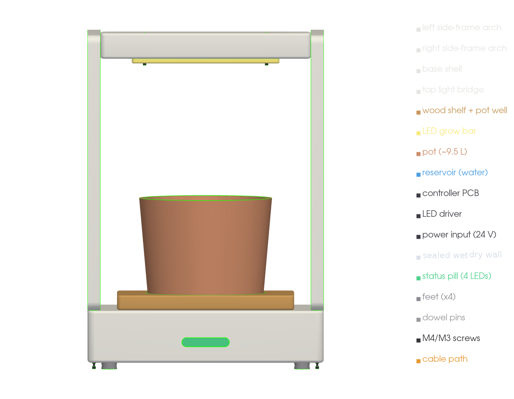 ·
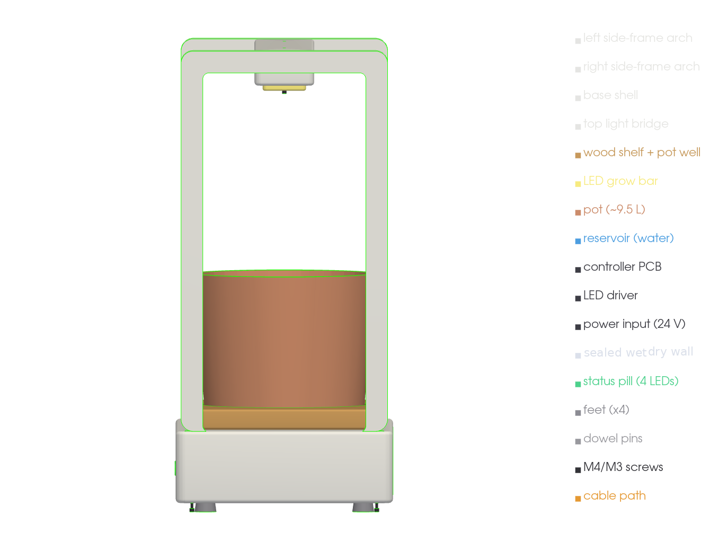 ·
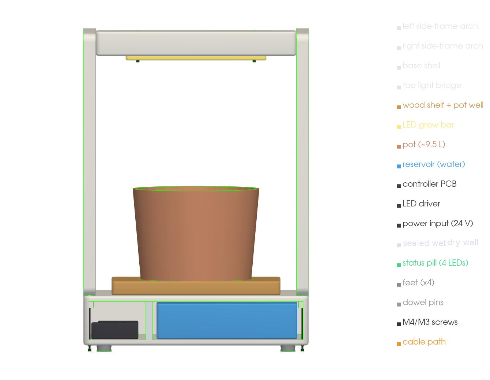

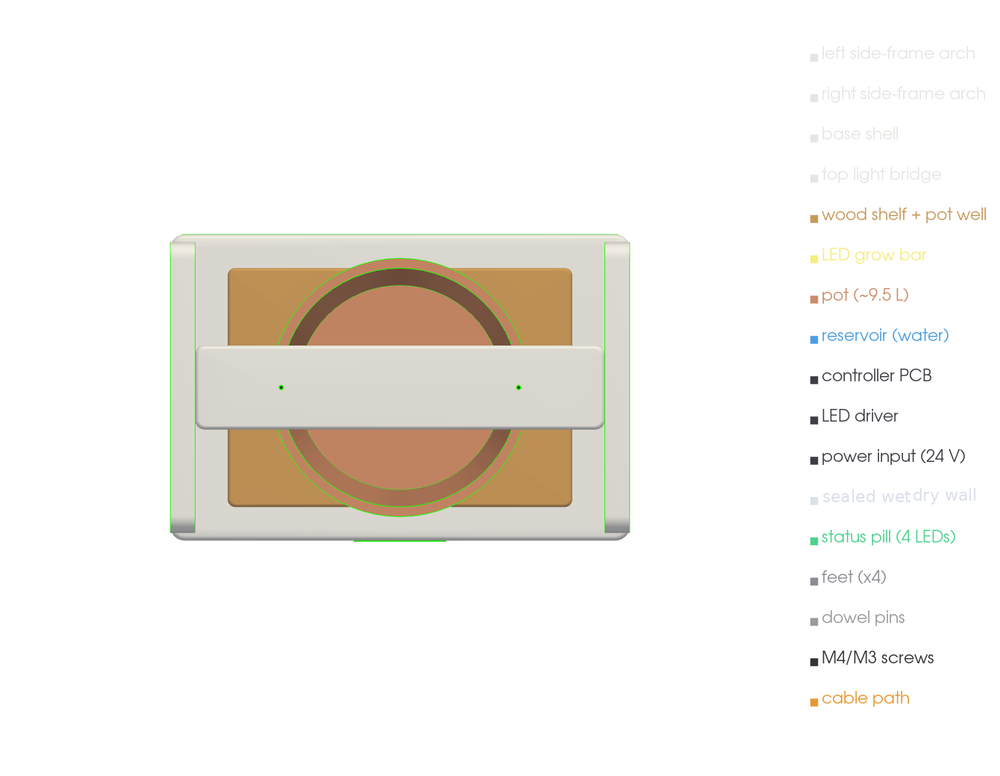 ·
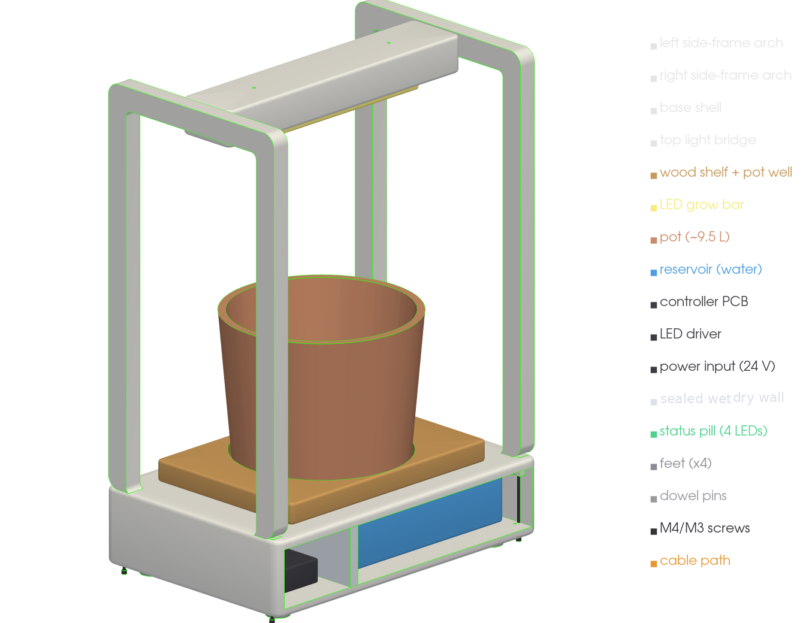

## Validation (debug colours)

**LED centering** — crosshair at X = 240, Y = 160; the script confirms numerically:
`LED centroid X=240.0 Y=160.0`, `pot centroid X=240.0 Y=160.0`.

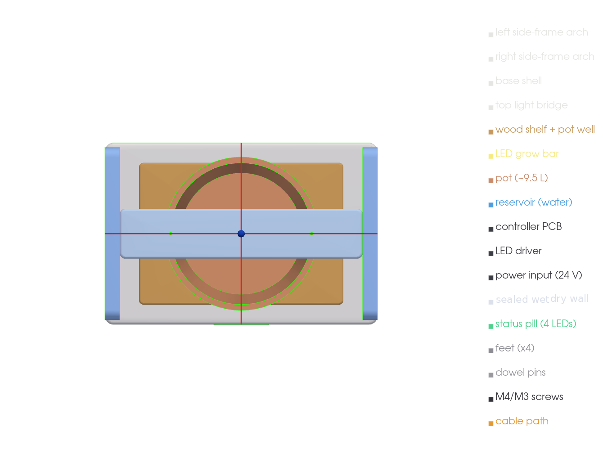

**Exploded assembly** — parts + joint hardware (dowel pins, M4/M3 screws):

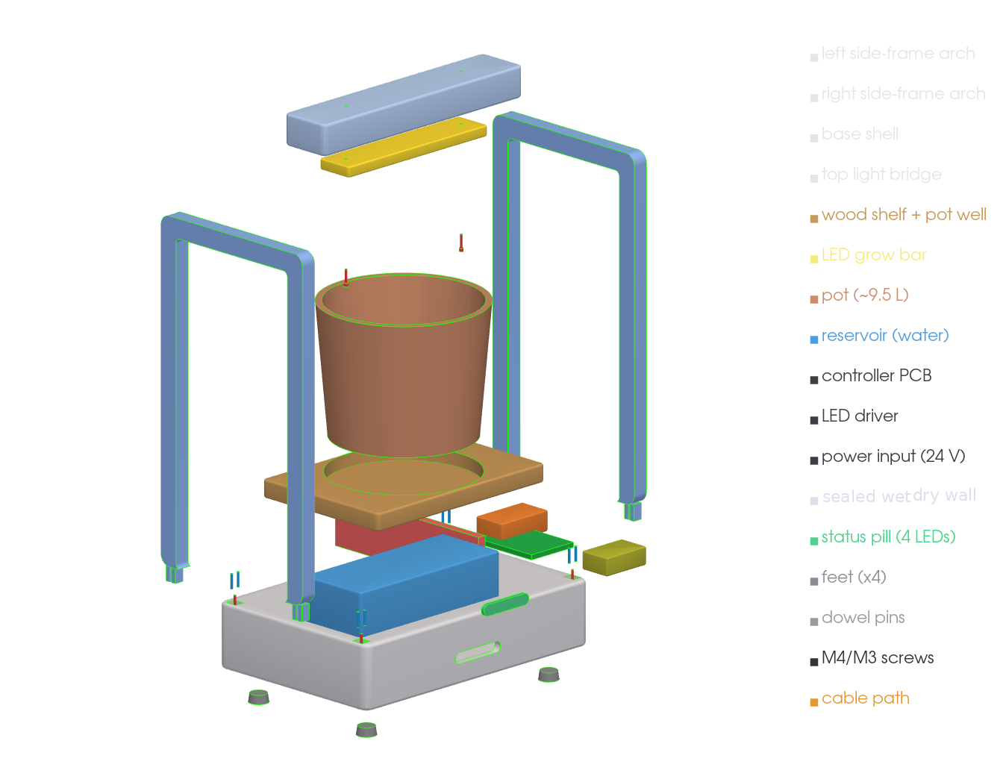

**Underside (screw access)** · **base service cutaway** · **right-rear-arch conduit
cross-section** (cable path base → arch → bridge → LED):

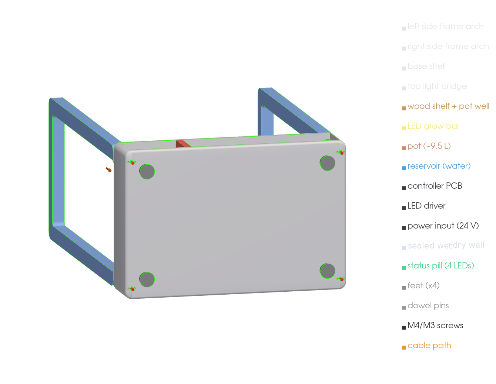

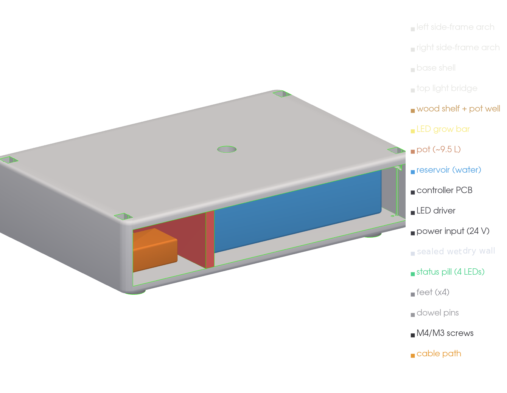

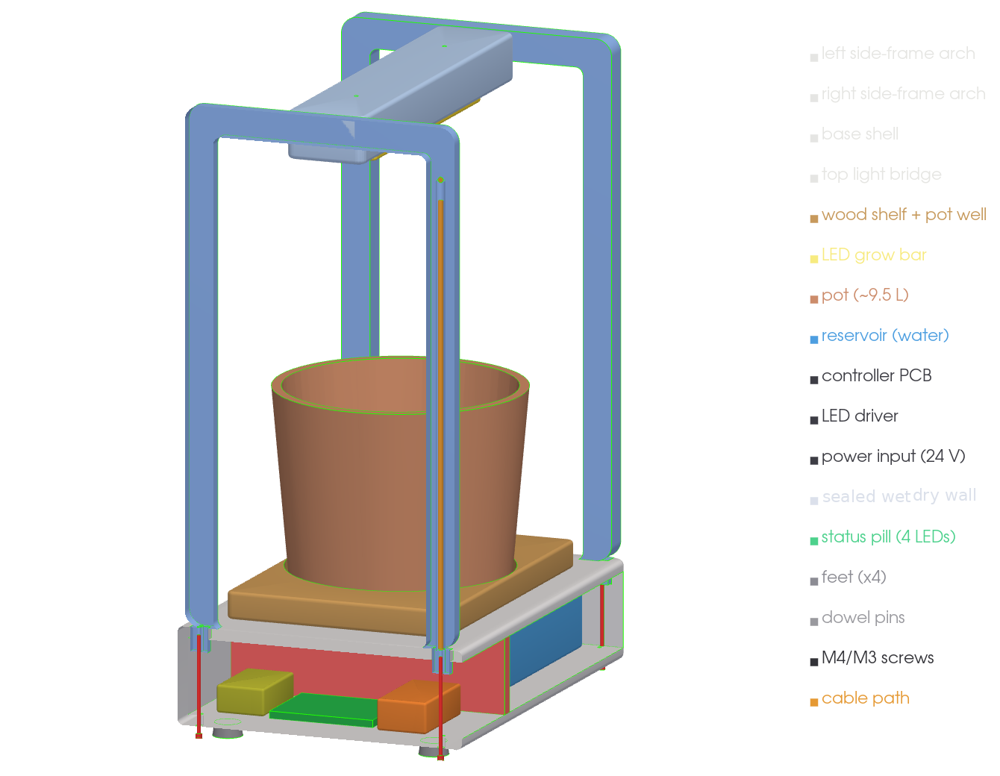

## Checks

- **Geometry audit (`audit.py`) — CLEAN.** Honest interference check on the real meshes
  with **no whitelist**: it measures the true boolean **overlap volume** of every pair (so
  abutting/touching faces are *not* mistaken for interpenetration) and each part's
  **nearest-neighbour gap** (so a floating/unsupported part is caught — a collision check
  alone never flags a gap). Result: **no interpenetration > 80 mm³ and no floating parts.**
  Hardware (dowels, screws) sits in real clearance holes/sockets; reservoir + electronics
  are seated on the base floor; the bridge abuts the arches; the status pill sits in its
  front slot. *(Earlier whitelisted collision checks masked several real overlaps/floats;
  this volume audit replaces them.)*
- **Joints:** each arch foot tenons 26 mm into a base socket with 2 dowel pins + a
  hidden M4 from the underside (counterbored for a driver); the bridge tongues into the
  arch tops with dowels + screws. See [fastening & assembly](fastening.md).
- **Free-standing physics sim (MuJoCo) — PASS.** `mechanical/cad/physics_sim.py`:
  **only the ground is fixed** — the ~21 kg unit (pot 10 kg) rests on its **4 feet** under
  gravity; joints modelled as dowel + screw `connect` constraints (welds for seated parts).
  After settling: **base settles 0.028 mm, tilt 0.000°** (doesn't sink or tip) and parts
  move **0.024 mm / 0.003° relative to the base** (joints rigid) — all well under the
  0.5 mm / 0.5° limit. Removing **each screw one at a time — and all screws together —
  gives the identical result**, proving the **dowels/tabs carry the shear** (joints are not
  screw-dependent for holding). *(Idealised rigid-body + pin/weld constraints with ground
  contact, not FEA: validates free-standing stability and joint redundancy, not material
  stress.)*

Reproduce:

```sh
.venv-cad/bin/python mechanical/cad/render_block.py   # export parts + renders
.venv-cad/bin/python mechanical/cad/audit.py          # interference (volume) + float audit
.venv-cad/bin/python mechanical/cad/physics_sim.py    # MuJoCo settling + screw-removal test
openscad -D 'part="base"' --render -o base.stl mechanical/cad/opencanopy_tabletop_pepper_v1_block_model.scad
```
