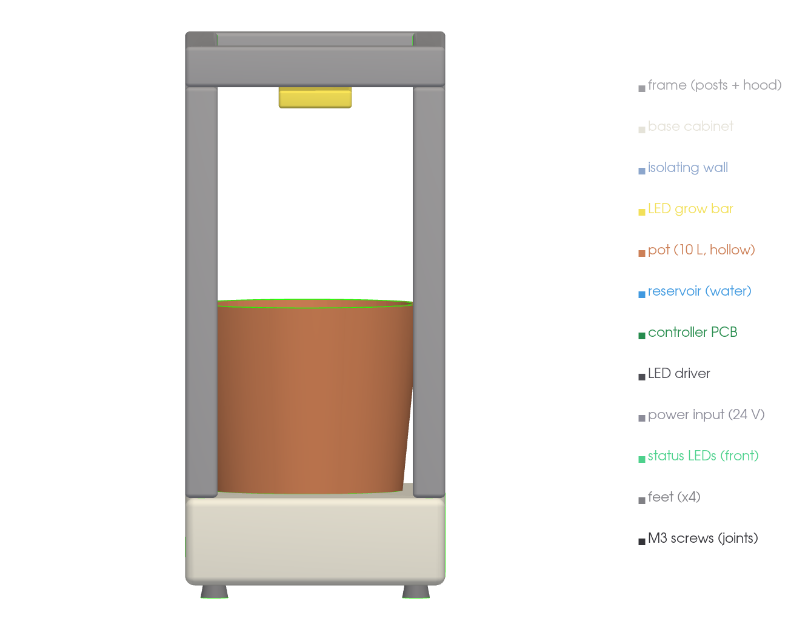
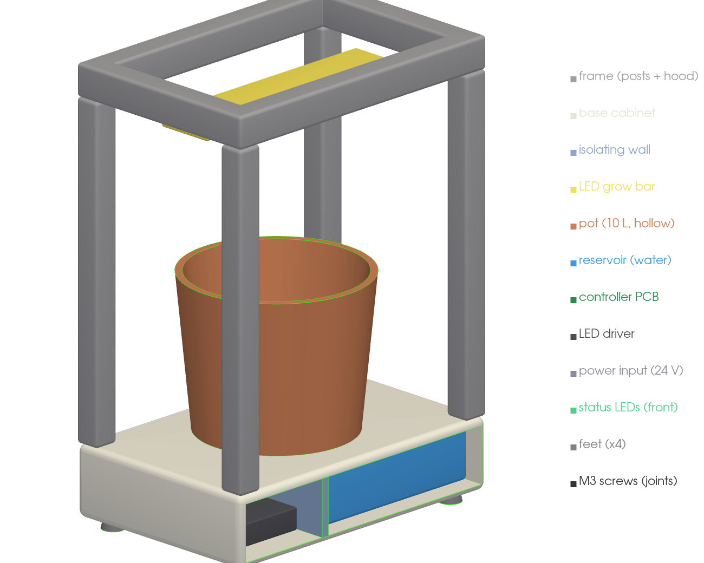

# Mechanical build — v0 block model

Renders of the **OpenCanopy V1 v0 block model** within the locked **480 × 320 × 680 mm**
envelope, from the parametric OpenSCAD source
(`mechanical/cad/opencanopy_tabletop_pepper_v1_block_model.scad`, per the
[CAD brief](cad_brief_for_claude.md)). Rendered with a real z-buffered renderer (VTK)
and collision-checked with FCL — see `mechanical/cad/render_block.py`.

**Architecture:** open-frame tabletop unit — rounded base cabinet + four rounded corner
posts + top hood, on **four feet**, **open front, sides and back**. **Electronics live in
the base, *beside* the water reservoir, isolated by an additional vertical wall** (wet |
wall | dry). Fixed LED grow bar under the hood; 4-LED status strip on the front; no
screen, no controls. Cables route **through the hollow posts** (no external channel).
Parts bolt together with **M3 heat-set inserts + screws** — see
[fastening & assembly](fastening.md).

## Exterior





## Open back + internals

The back is open for service; the base splits into two compartments behind an isolating
wall. The cutaway view makes the layout explicit — **reservoir (water) on the left, the
isolating wall, then the dry electronics (controller PCB, LED driver, 24 V power) on the
right, beside the water**:




## Validation

- **Collision (FCL):** every part-vs-part pair is checked; **no unintended collisions**
  — the electronics clear the cabinet walls (≥ 6 mm) and are separated from the water by
  the isolating wall. Run: `.venv-cad/bin/python mechanical/cad/render_block.py`.
- **v0 acceptance (brief):** opens without errors; envelope 480 × 320 × 680; open
  front/sides/back; all modules present; **electronics in the base, beside/isolated from
  the water**; no screen or controls. All met.

Reproduce:

```sh
# whole assembly STL
openscad -o out.stl mechanical/cad/opencanopy_tabletop_pepper_v1_block_model.scad
# one part (for inspection): -D 'part="pot"'   (pot/reservoir/pcb/driver/iso_wall/…)
# all renders + collision check:
.venv-cad/bin/python mechanical/cad/render_block.py
```
