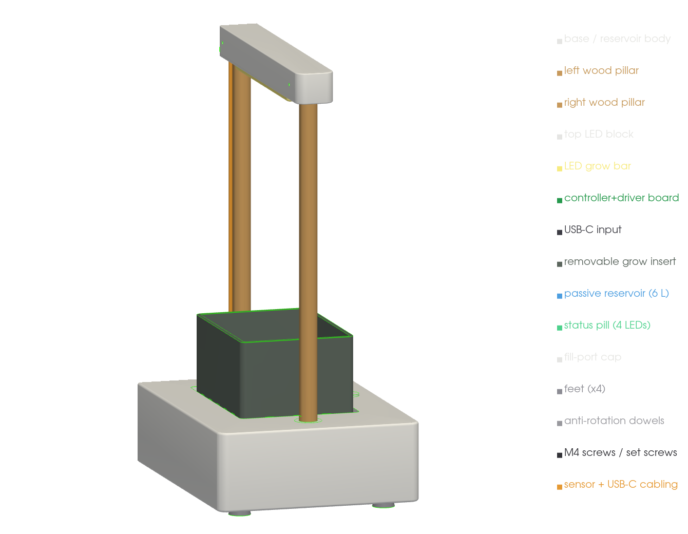

# Mechanical build — v1 product model

Renders of the **OpenCanopy v1 product model** (480 × 320 × 680 mm) from the parametric
OpenSCAD source (`mechanical/cad/opencanopy_tabletop_pepper_v1_block_model.scad`),
rendered with VTK (`mechanical/cad/render_block.py`) and validated by an honest,
no-whitelist geometry audit (`mechanical/cad/audit.py`).

**Architecture (major redesign — two-pillar Scandinavian form):**

- One **low integrated base** (the product body, 135 mm) — a **single wet zone**: a passive
  **6 L reservoir** + an integrated **grow well**. There is **no electronics bay in the base**.
- **Two vertical wooden pillars** (Ø28) rising from dry structural bosses, **centred on the
  base depth**.
- One horizontal **top LED block** spanning the pillars; the LED is centred over the grow
  module, and the **small 1.6 mm controller + driver PCB is encapsulated inside the block**
  (an internal bay on standoff bosses, 4 mounting holes), with a **USB-C port through the
  rear face** — no board is exposed. The block prints in two parts (body + bottom lid).
- A **removable raised grow insert** (slotted/perforated, semi-hydro) for one pepper plant.
- **Passive self-watering** (reservoir + wicking). **No pump, no fan, no screen/controls;
  4 status LEDs only.**

**Wet/dry separation is now top (electronics) vs bottom (water)** — not an in-base wall. Only
sealed low-voltage sensor leads + status-LED light pipes touch the base (entering through a
grommet at the right pillar); power (USB-C) enters at the top. Pillars and the grow module
share Y (= 160, base centre) so a thin block places the LED directly over the plant with no
cantilever. The base stays low because the grow insert is a **raised planter** above the top.

## Product views


 ·
 ·


 ·


## Validation (debug colours)

**LED centering** — the LED optical centreline and the grow module are both at X = 240,
Y = 160; the script confirms numerically `LED<->grow offset dX=0.0 dY=0.0` (acceptance ≤ 5 mm).


**Exploded assembly** · **underside (pillar screw access)** · **base service cutaway**
(reservoir + raised insert + wick path) · **cable cross-section** (sensor leads up the rear of
the right pillar to the top board):


 ·
 ·


## Checks

- **Geometry audit (`audit.py`) — CLEAN.** Honest interference check on the real meshes with
  **no whitelist**: it measures the true boolean **overlap volume** of every part pair (so
  abutting/touching faces are *not* mistaken for interpenetration) and each part's
  **nearest-neighbour gap** (so a floating/unsupported part is caught). Result: **no
  interpenetration > 80 mm³ and no floating parts.** Hardware sits in real clearance holes; the
  reservoir and raised insert are seated with a 0.5 mm wick gap; the boards/USB-C mount under
  the block; the status pill sits in its front slot.
- **LED centred over the grow module** — optical centre offset **0.0 / 0.0 mm** (≤ 5 mm limit).
- **Reservoir** — **6.6 L** gross (≥ 6 L usable target). The grow insert is a **raised planter**
  so the base stays low (≤ 130 mm visible); media capacity is a documented trade-off (see
  ECO-002 / open questions) pending a grow trial.
- **Joints:** each pillar seats 30 mm into a base socket with an **M4 from the underside** into a
  threaded insert + an **anti-rotation dowel**; the block sockets onto the pillar tops with a
  **rear set screw**. See [fastening & assembly](fastening.md).
- **Physics sim:** the free-standing MuJoCo sim is being re-built for the two-pillar
  architecture (`mechanical/cad/physics_sim.py`) — not yet re-run for this model.

Reproduce:

```sh
.venv-cad/bin/python mechanical/cad/render_block.py   # export parts + renders
.venv-cad/bin/python mechanical/cad/audit.py          # interference (volume) + float audit
openscad -D 'part="base"' --render -o base.stl mechanical/cad/opencanopy_tabletop_pepper_v1_block_model.scad
```
